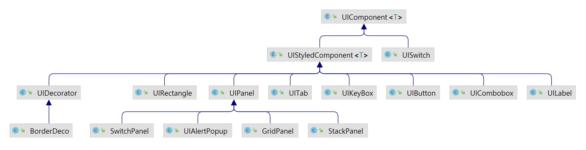

# 마인크래프트 1.16.4 한글 패치

마인크래프트에서 한글을 입력할 수 있게 하는 패치입니다.

[배포 포스트](https://blog.naver.com/won983212)

[2차 배포 포스트](https://www.koreaminecraft.net/mod/3750)

1.16.4버전은 기존에 지원하던 기능을 대부분 제외하고 한글 입력에만 집중했습니다. 이전 한글패치 소스는 아래에서 확인해주세요.

[1.11.2버전 한글패치 소스](https://github.com/won983212/KoreanInputPatch-Legacy)

## 아키텍처

### 한글 입력기

한글 입력기는 마인크래프트의 키 입력을 중간에 가로채어 한글로 변환합니다. 키 입력을 가로채기 위해 
마인크래프트 소스 코드를 변조해야합니다. 코드 변조는 Bytecode단위로 이루어지며, Forge에서 제공하는
[Mixin](https://github.com/SpongePowered/Mixin)를 활용해 직접 bytecode를 주입합니다.

마인크래프트에서 Textfield, 팻말(sign), 책에 키 입력이 들어오면, 입력을 InputWrapper로 보냅니다.
InputWrapper는 키 입력이나 마우스 입력을 적절한 처리기로 전송하는 중간자 역할입니다.
실제로는 내부에 InputProcessor를 가지고 있고, 이를 통해 입력을 처리합니다. 

InputProcessor는 한글 입력, 한자 입력, 색상 입력을 지원합니다. 사용자 입력은 각 처리기에서 적절히
처리되며, 한번에 하나의 입력기만 처리할 수 있습니다. (색상 입력 도중에는 한글 입력X)

#### 한글 입력 처리기

한글 입력 처리기는 영어 키 입력을 한글로 바꾸고, 조합해줍니다. 예를 들어 "dkssud"이라고
입력하면, "안녕"으로 변환합니다. 이 과정이 실시간으로 이루어져야 하기 때문에 d, k, s와 같은 입력
스트림을 실시간으로 처리해야합니다. 즉 아래와 같이 되어야 합니다.

| 입력 | 변환 |
|----|----|
| d  | ㅇ  |
| k  | 아  |
| s  | 안  |
| s  | 안ㄴ |
| u  | 안녀 |
| d  | 안녕 |

이를 처리하기위해 한글 입력 처리기는 상태 기계(State Machine)를 사용합니다. 실시간으로 사용자의
입력을 상태로 저장하고, 입력한 키에 따라 상태를 변경합니다. 위의 테이블에서 처럼 영어로 입력된 키를
한글 타자로 변환하고, 기존의 한글 텍스트에 조합해야합니다.
이 알고리즘은 KoreanInput을 참고하세요.

### UI 시스템

UIComponent를 기반으로 동작합니다. WPF/C#의 시스템을 일부
모방했습니다. ([링크](https://learn.microsoft.com/ko-kr/dotnet/desktop/wpf/advanced/wpf-architecture?view=netframeworkdesktop-4.8))

#### UIComponent

베이스가 되는 컴포넌트입니다. 버튼, 텍스트필드, 콤보박스 등이 모두 이 컴포넌트를 상속받아 구현됩니다.
컴포넌트의 위치 정보, 너비, 높이 정보를 포함합니다. 그리고 margin, padding 등과 같이 layout관련 속성들도 포함하고 있습니다.
여러 개의 컴포넌트를 포함할 수 있는 Panel 등에 이 컴포넌트를 배치할 때, layout관련 속성들을 활용합니다.
UIComponent는 OpenGL로 요소들을 화면에 그립니다.

#### UIStyledComponent

UIComponent에 색상, 두께 등 스타일링과 관련된 속성이 추가된 컴포넌트입니다. 스타일링이 필요한 컴포넌트 대부분은 이 클래스를
상속받아 사용합니다.

#### UIPanel

여러 개의 UI컴포넌트를 담을 수 있습니다. UIPanel또한 UIComponent를 상속받아 구현되어 있습니다. 그래서 Panel안에 Panel을 넣어
복잡한 UI를 구성할 수 있습니다. Panel안에 배치된 컴포넌트들은 Panel의 layout관련 속성들을 활용하여 배치됩니다.

Panel은 StackPanel, GridPanel, SwitchPanel이 제공되며, Android나 WPF의 Panel들을 모방했습니다.

## 참고

- [SDK setup 방법](FORGE_README.md)